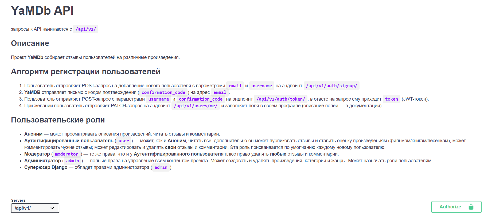

# API_YAMDB



### **Проект выполнен в рамках обучения в YandexPracticum.**

REST Like Backend проекта сбора отзывов выполнен согласно представленной в ТЗ документации, оформленой по стандартам OpenAPI в виде [ReDoc](https://github.com/genriber/api_yamdb/blob/master/api_yamdb/static/redoc.yaml) веб станицы. Для соблюдения принципов DRY и SOLID в разработке используются Rest_framework ViewSet, Generics, Mixins. Для авторизации применяются JWT токены.

### Как запустить проект:

Клонировать репозиторий и перейти в него в командной строке:

```
git clone https://github.com/genriber/api_yamdb.git
```

```
cd api_yamdb
```

Cоздать и активировать виртуальное окружение:

```
python3.9 -m venv env
```

* Если у вас Linux/macOS

  ```
  source env/bin/activate
  ```
* Если у вас windows

  ```
  source env/scripts/activate
  ```

```
python3.9 -m pip install --upgrade pip
```

Установить зависимости из файла requirements.txt:

```
pip install -r requirements.txt
```

Выполнить миграции:

```
python manage.py migrate
```

Запустить проект:

```
python manage.py runserver
```
